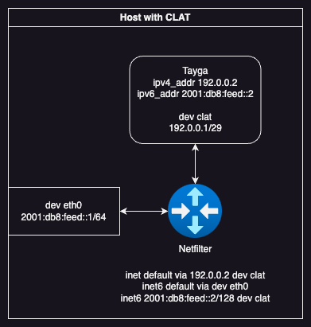

# Client-Side Translator (CLAT)

This example configures Tayga to perform stateless CLAT function, used in 464xlat. This provides IPv4 functionality to the local system, relying on the network to provide NAT64. 

## 464XLAT Architecture
CLAT functionality may be seen as a specialized form of SIIT with exactly one mapping usable only by the local system. The translator (Tayga) performs address translation for exactly one IPv4 address, usually taken from the DSLite range (192.0.0.0/29) to exactly one IPv6 address. The local system is assigned an IP in the DSLite range, and uses this IP to communicate with Tayga and therefore the rest of the IPv4 internet. 464xlat is only designed to provide access to outgoing connections over IPv4, it is not designed for unsolicited incoming traffic, but traditional NAT traversal methods do work. 

## Data Path
In this example, one interface is used:
* `eth0` represents the physical interface of the system, which is likely IPv6-only
* `clat` is the name of the tunnel interface created by Tayga

In this example, the following IP addresses are used internally:
* `64:ff9b::/96` is used as the NAT64 prefix `pref64`
* `2001:db8:feed::/64` is used as the LAN subnet on `eth0`
* `192.0.0.0/29` is used as the translation subnet for the local system, as it is reserved for IPv4 to IPv6 transition technologies 
* `192.168.0.1/29` is used as the IPv4 address of the local system
* `192.168.0.2/29` is used as the IPv4 address of Tayga itself
* `2001:db8:feed::6` is used as the IPv6 address of Tayga itself
* `2001:db8:feed::7` is used as the IPv6 address for translated user traffic

The architecture for all methods is the same:

## Incoming Connections
The Proxy NDP or Dynamic Routing methods both allow incoming connections to IPv4-only software on the host, however, incoming connections must themselves be from IPv4-translated addresses, as Tayga has no way of translating the source address otherwise. 

# Proxy NDP
In this approach, a new address on the LAN subnet is generated for use by Tayga. To allow access to the LAN subnet by Tayga, this address is specified for NDP Proxying on the LAN interface, and routed to the Tayga translation interface. This scenario works well if the LAN addresses are assigned via SLAAC, allowing the host to generate additional address(es) for use by the translator. 

# NAT66
If the translator is unable to assign an additional address (for example, if the host is forced to use DHCPv6 IA_NA addressing), we can instead use NAT66 to masquerade traffic from the translator to the address already assigned to the host. 

# Dynamic Routing
If the host participates in dynamic routing, we can instead assign a routed address to the translator, and rely on the dynamic routing algorithm to route traffic. This approach can also be used where the host has requested a dedicated prefix using DHCPv6 IA_PD, for example, some container hosts may allocate a /64 to each host.
